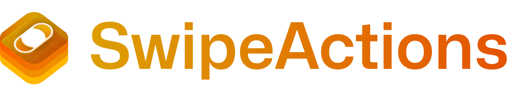
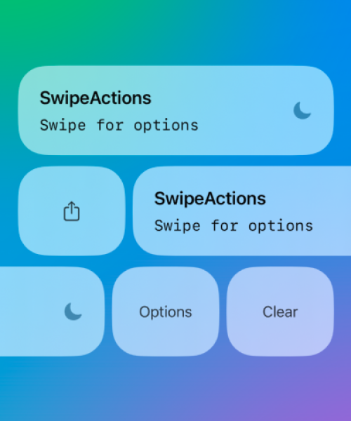
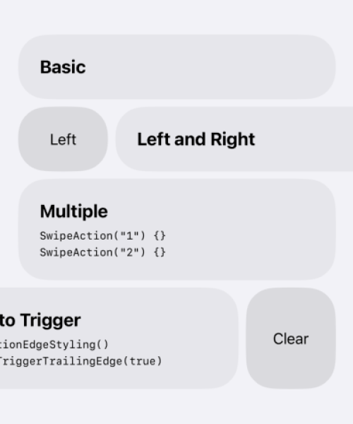
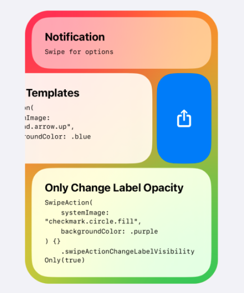
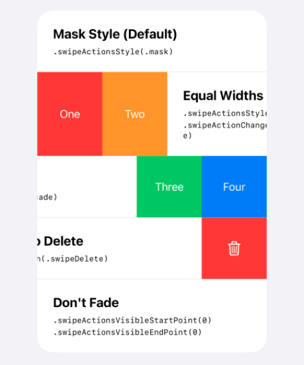
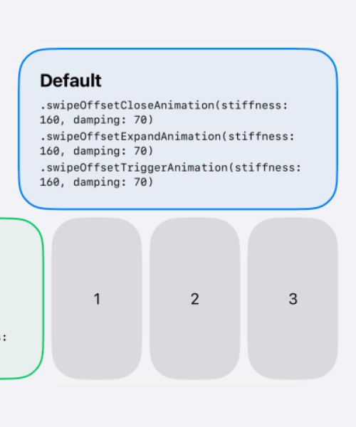
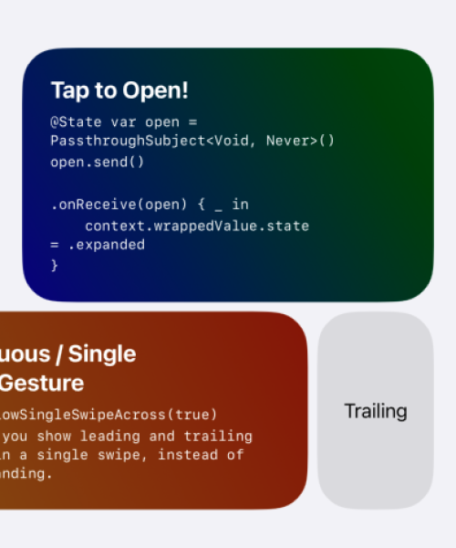
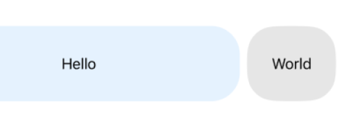
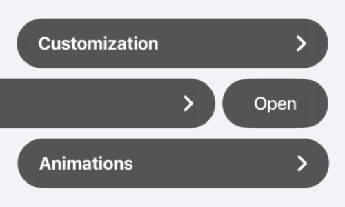

<a href="#"></a>

Add customizable swipe actions to any view.

- Enable swipe actions on any view, not just Lists.
- Customize literally everything — corner radius, color, etc...
- Supports drag-to-delete and advanced gesture handling.
- Fine-tune animations and styling to your taste.
- Programmatically show/hide swipe actions.
- Automatically close when interacting with other views.
- Made with 100% SwiftUI. Supports iOS 14+.
- Lightweight, no dependencies. One file.


 |  | 
| --- | --- | --- |
 |  | 


### Installation

SwipeActions is available via the [Swift Package Manager](https://developer.apple.com/documentation/swift_packages/adding_package_dependencies_to_your_app). Alternatively, because all of SwipeActions is contained within a single file, drag [`SwipeActions.swift`](https://github.com/aheze/SwipeActions/blob/main/Sources/SwipeActions.swift) into your project. Requires iOS 14+.

```
https://github.com/aheze/SwipeActions
```

### Usage

```swift
import SwiftUI
import SwipeActions

struct ContentView: View {
    var body: some View {
        SwipeView {
            Text("Hello")
                .frame(maxWidth: .infinity)
                .padding(.vertical, 32)
                .background(Color.blue.opacity(0.1))
                .cornerRadius(32)
        } trailingActions: { _ in
            SwipeAction("World") {
                print("Tapped!")
            }
        }
        .padding()
    }
}
```




### Examples

Check out the [example app](https://github.com/aheze/SwipeActions/archive/refs/heads/main.zip) for all examples and advanced usage!


### Customization

SwipeActions supports over 20 modifiers for customization. To use them, simply attach the modifier to `SwipeAction`/`SwipeView`.

```swift
SwipeView {
    Text("Hello")
} leadingActions: { _ in
} trailingActions: { _ in
    SwipeAction("World") {
        print("Tapped!")
    }
    .allowSwipeToTrigger() /// Modifiers for `SwipeAction` go here.
}
.swipeActionsStyle(.cascade) /// Modifiers for `SwipeView` go here.
```

```swift
// MARK: - Available modifiers for `SwipeAction` (the side views)

/**
 Apply this to the edge action to enable drag-to-trigger.

     SwipeView {
         Text("Swipe")
     } leadingActions: { _ in
         SwipeAction("1") {}
             .allowSwipeToTrigger()

         SwipeAction("2") {}
     } trailingActions: { _ in
         SwipeAction("3") {}

         SwipeAction("4") {}
             .allowSwipeToTrigger()
     }
 */
func allowSwipeToTrigger(_ value: Bool = true)

/// Constrain the action's content size (helpful for text).
func swipeActionLabelFixedSize(_ value: Bool = true) 

/// Additional horizontal padding.
func swipeActionLabelHorizontalPadding(_ value: Double = 16)

/// The opacity of the swipe actions, determined by `actionsVisibleStartPoint` and `actionsVisibleEndPoint`.
func swipeActionChangeLabelVisibilityOnly(_ value: Bool) 
```

```swift
// MARK: - Available modifiers for `SwipeView` (the main view)

/// The minimum distance needed to drag to start the gesture. Should be more than 0 for best compatibility with other gestures/buttons.
func swipeMinimumDistance(_ value: Double) 

/// The style to use (`mask`, `equalWidths`, or `cascade`).
func swipeActionsStyle(_ value: SwipeActionStyle) 

/// The corner radius that encompasses all actions.
func swipeActionsMaskCornerRadius(_ value: Double) 

/// At what point the actions start becoming visible.
func swipeActionsVisibleStartPoint(_ value: Double) 

/// At what point the actions become fully visible.
func swipeActionsVisibleEndPoint(_ value: Double)

/// The corner radius for each action.
func swipeActionCornerRadius(_ value: Double) 

/// The width for each action.
func swipeActionWidth(_ value: Double) 

/// Spacing between actions and the label view.
func swipeSpacing(_ value: Double) 

/// The point where the user must drag to expand actions.
func swipeReadyToExpandPadding(_ value: Double) 

/// The point where the user must drag to enter the `triggering` state.
func swipeReadyToTriggerPadding(_ value: Double) 

/// Ensure that the user must drag a significant amount to trigger the edge action, even if the actions' total width is small.
func swipeMinimumPointToTrigger(_ value: Double) 

/// Applies if `swipeToTriggerLeadingEdge/swipeToTriggerTrailingEdge` is true.
func swipeEnableTriggerHaptics(_ value: Bool) 

/// Applies if `swipeToTriggerLeadingEdge/swipeToTriggerTrailingEdge` is false, or when there's no actions on one side.
func swipeStretchRubberBandingPower(_ value: Double)

/// If true, you can change from the leading to the trailing actions in one single swipe.
func swipeAllowSingleSwipeAcross(_ value: Bool) 

/// The animation used for adjusting the content's view when it's triggered.
func swipeActionContentTriggerAnimation(_ value: Animation)

/// Values for controlling the close animation.
func swipeOffsetCloseAnimation(stiffness: Double, damping: Double)

/// Values for controlling the expand animation.
func swipeOffsetExpandAnimation(stiffness: Double, damping: Double)

/// Values for controlling the trigger animation.
func swipeOffsetTriggerAnimation(stiffness: Double, damping: Double)
```

Example usage of these modifiers is available in the [example app](https://github.com/aheze/SwipeActions/archive/refs/heads/main.zip).

### Notes

- To automatically close swipe views when another one is swiped (accordion style), use `SwipeViewGroup`.

```swift
SwipeViewGroup {
    SwipeView {} /// Only one of the actions will be shown.
    SwipeView {}
    SwipeView {}
}
```

- To programmatically show/hide actions, use the `context` parameter.

```swift
import Combine
import SwiftUI
import SwipeActions

struct ProgrammaticSwipeView: View {
    @State var open = PassthroughSubject<Void, Never>()

    var body: some View {
        SwipeView {
            Button {
                open.send() /// Fire the `PassthroughSubject`.
            } label: {
                Text("Tap to Open")
                    .frame(maxWidth: .infinity)
                    .padding(.vertical, 32)
                    .background(Color.blue.opacity(0.1))
                    .cornerRadius(32)
            }
        } trailingActions: { context in
            SwipeAction("Tap to Close") {
                context.wrappedValue.state = .closed
            }
            .onReceive(open) { _ in /// Receive the `PassthroughSubject`.
                context.wrappedValue.state = .expanded
            }
        }
    }
}
```

- To enable swiping on transparent areas, add `.contentShape(Rectangle())`.

```swift
SwipeView {
    Text("Lots of empty space here.")
        .frame(maxWidth: .infinity)
        .padding(.vertical, 32)
        .contentShape(Rectangle()) /// Enable swiping on the empty space.
} trailingActions: { _ in
    SwipeAction("Hello!") { }
}
```

- Everything in the example app is swipeable — even the gray-capsule headers!




### Community

Author | Contributing | Need Help?
--- | --- | ---
SwipeActions is made by [aheze](https://github.com/aheze). | All contributions are welcome. Just [fork](https://github.com/aheze/SwipeActions/fork) the repo, then make a pull request. | Open an [issue](https://github.com/aheze/SwipeActions/issues) or join the [Discord server](https://discord.com/invite/Pmq8fYcus2). You can also ping me on [Twitter](https://twitter.com/aheze0).

### License

```
MIT License

Copyright (c) 2023 A. Zheng

Permission is hereby granted, free of charge, to any person obtaining a copy
of this software and associated documentation files (the "Software"), to deal
in the Software without restriction, including without limitation the rights
to use, copy, modify, merge, publish, distribute, sublicense, and/or sell
copies of the Software, and to permit persons to whom the Software is
furnished to do so, subject to the following conditions:

The above copyright notice and this permission notice shall be included in all
copies or substantial portions of the Software.

THE SOFTWARE IS PROVIDED "AS IS", WITHOUT WARRANTY OF ANY KIND, EXPRESS OR
IMPLIED, INCLUDING BUT NOT LIMITED TO THE WARRANTIES OF MERCHANTABILITY,
FITNESS FOR A PARTICULAR PURPOSE AND NONINFRINGEMENT. IN NO EVENT SHALL THE
AUTHORS OR COPYRIGHT HOLDERS BE LIABLE FOR ANY CLAIM, DAMAGES OR OTHER
LIABILITY, WHETHER IN AN ACTION OF CONTRACT, TORT OR OTHERWISE, ARISING FROM,
OUT OF OR IN CONNECTION WITH THE SOFTWARE OR THE USE OR OTHER DEALINGS IN THE
SOFTWARE.
```

---

https://user-images.githubusercontent.com/49819455/231671743-baca394e-fc74-4062-83eb-2024b8add924.mp4
